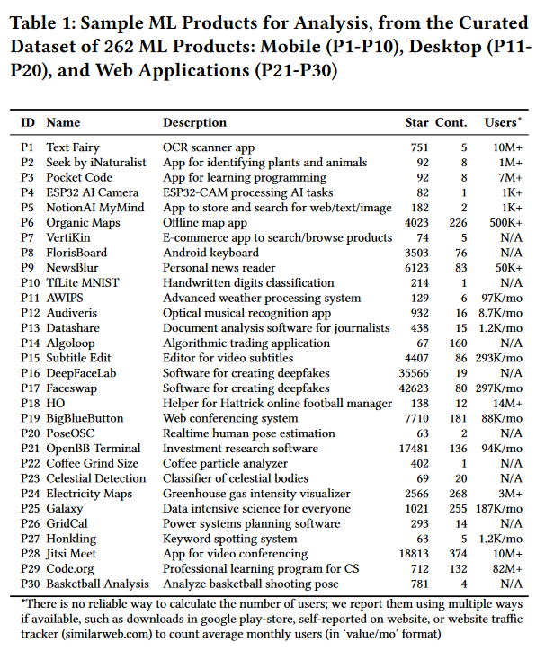

# AISA Study Project ML Deployment Options

## Deployment Tools

* Frameworks
  * AWS
  * Google Cloud
  * MLflow
  * Tensorflow
  * Pytorch
* Open-source ML products reference:
* 
  * (Table 1., Nahar et al., 2023, p. 1, 10.48550/arXiv.2308.04328)

## Criteria

## Integrate with your tools

- Basecamp
- GitLab
- bwCloud
- Overleaf

## Test and Deploy

Do we need to test any code?

---

## Topic

Focus: comparing tools for deployment of models.

Source: literatures study, major selling points of a tool, other comparisons/independent reviews, come up by ourselves.

Initialization: List of tools and criteria for comparison.

Size of Criteria: depends, expectation 10-20.

Evaluate ease of deployment: use trial/evaluation programms like bwCloud, evaluate tutorials or experience reports, hands-on evaluation with limited number of options for manageable scope.

## Timeline

December to March

## Teams

flexible online biweekly meetings on Tuesdays at 4:30 p.m. starts from 2023-
11-28

## Registration

starts from 2023-11-15 on Campus

## License

Do we need License for this project?

## Project status

Beginns at 2023-12-04
