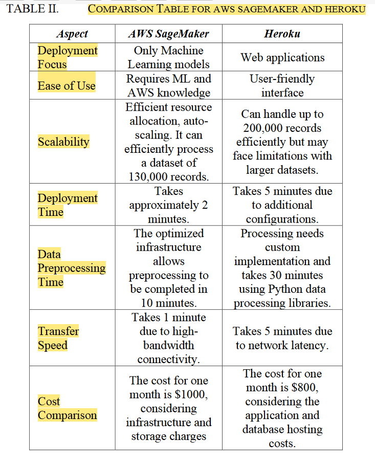

# AISA Study Project ML Deployment Options

## Deployment Tools

* Frameworks

  * [AWS Sagemaker](https://aws.amazon.com/sagemaker/)
    * not much customization available
    * can be used only with AWS ecosystem
  * [Azure ML](https://azure.microsoft.com/en-us/free/machine-learning/)
    * [see more info here](https://learn.microsoft.com/en-us/azure/machine-learning/tutorial-deploy-model?view=azureml-api-2)
  * [BentoML](https://docs.bentoml.com/en/latest/)
  * [KubeFlow](https://www.kubeflow.org/)
    * integration with Kubernetes
    * Open-source
    * Serving using KServe
  * Google Cloud (is it same as vertex ai??)
  * [MLflow](https://mlflow.org/)
    * Open-source
  * [RayServe](https://docs.ray.io/en/latest/serve/index.html)
  * [Seldon Core](https://www.seldon.io/solutions/core-plus)
  * [Tensorflow Serving](https://www.tensorflow.org/tfx/guide/serving)
  * [TorchServe](https://pytorch.org/serve/)
    * work only with Pytorch models
    * simple and lightweight
  * [Vertex AI](https://cloud.google.com/vertex-ai/docs)
  * ~~[Cortex.ml](https://github.com/mbrukman/cortex-ml)~~
    * no longer maintained
  * [~~BudgetML~~](https://github.com/ebhy/budgetml)
    * no longer maintained
* Open-source ML products reference:

  

  * (Table 1., Nahar et al., 2023, p. 1, 10.48550/arXiv.2308.04328)

## Criteria

**“COMPARISON TABLE FOR AWS SAGEMAKER AND HEROKU”** (R. V. Kulkarni, A. Thakur, S. Nalbalwar, S. Shah and S. Chordia, "Exploring Scalable and Efficient Deployment of Machine Learning Models: A Comparative Analysis of Amazon SageMaker and Heroku," 2023 International Conference on Information Technology (ICIT), Amman, Jordan, 2023, pp. 746-751, doi: 10.1109/ICIT58056.2023.10225793.):

## Integrate with our tools

- Basecamp
- GitLab
- bwCloud
- Overleaf

## Test and Deploy

Do we need to test any code?

---

## Topic

Focus: comparing tools for deployment of models.

Source: literature study, major selling points of a tool, other comparisons/independent reviews, come up by ourselves.

**Initialization: List of tools and criteria for comparison.

Size of Criteria: depends, expectation 10-20.

Evaluate ease of deployment: use trial/evaluation programms like bwCloud, evaluate tutorials or experience reports, hands-on evaluation with limited number of options for manageable scope.

## Timeline

December to March

## Teams

flexible online biweekly meetings on Tuesdays at 4:30 p.m. starts from 2023-
11-28

## Registration

starts from 2023-11-15 on Campus

## License

Do we need License for this project?

## Project status

Begins at 2023-12-04
